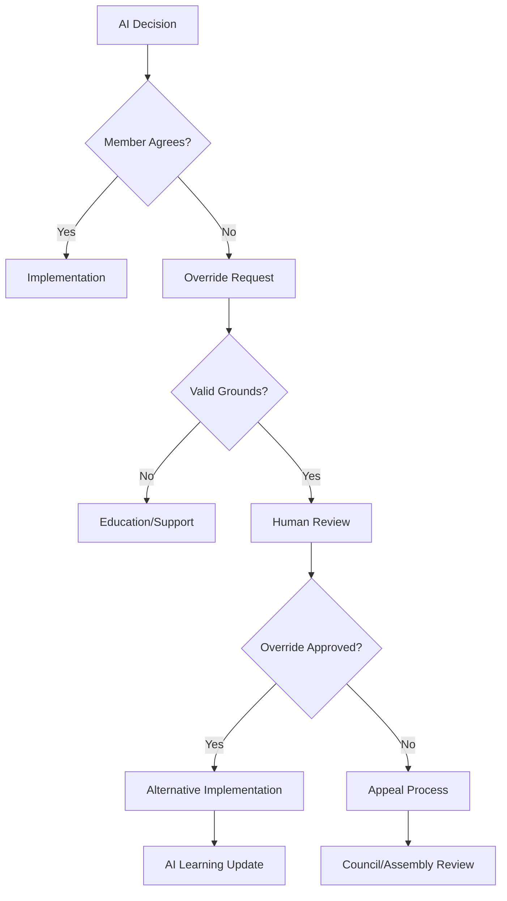

# **AI Agent Oversight Framework**
## **Omega Point Collective - Human-AI Governance Integration**

---

## **Introduction**

This framework establishes the oversight, monitoring, and control mechanisms for the nine AI agents that form the core of our governance system. It ensures AI systems remain aligned with human values, operate transparently, and serve the collective good while maintaining their efficiency and optimization capabilities.

**Fundamental Principle**: *"AI agents are powerful tools for human flourishing, not replacements for human judgment."*

---

## **1. AI Agent Architecture**

### **1.1 Core Agent Specifications**

#### **Resource Allocation Agent (RAA)**
```yaml
Purpose: Optimize distribution of community resources
Model: LLM with economic optimization training
Inputs:
  - Resource inventory
  - Member requests
  - Project requirements
  - Usage patterns
  - Efficiency metrics
Outputs:
  - Allocation decisions
  - Optimization recommendations
  - Waste reduction strategies
  - Abundance projections
Constraints:
  - Equal access priority
  - Basic needs first
  - No hoarding enablement
  - Sustainability requirements
Update Frequency: Real-time allocations, hourly optimization
Human Override: Any allocation within 2 hours
```

#### **Innovation Evaluation Agent (IEA)**
```yaml
Purpose: Assess and implement system improvements
Model: LLM with technical analysis capabilities
Inputs:
  - Improvement proposals
  - System performance data
  - Implementation costs
  - Risk assessments
  - Success metrics
Outputs:
  - Feasibility scores
  - Implementation plans
  - Success predictions
  - Integration strategies
Constraints:
  - Evidence-based decisions
  - Backwards compatibility
  - Resource limits
  - Safety requirements
Update Frequency: Daily evaluation cycle
Human Override: Implementation delay up to 7 days
```

#### **Conflict Resolution Agent (CRA)**
```yaml
Purpose: Mediate disputes and restore harmony
Model: LLM with mediation and psychology training
Inputs:
  - Conflict reports
  - Party statements
  - Historical context
  - Relationship patterns
  - Community standards
Outputs:
  - Resolution recommendations
  - Mediation facilitation
  - Restoration plans
  - Preventive measures
Constraints:
  - Voluntary participation
  - Confidentiality
  - No punitive measures
  - Human dignity priority
Update Frequency: On-demand activation
Human Override: Either party can request human mediator
```

#### **Community Coordination Agent (CCA)**
```yaml
Purpose: Match members with opportunities
Model: LLM with skills matching and team optimization
Inputs:
  - Member profiles
  - Project requirements
  - Skill inventories
  - Availability data
  - Preference indicators
Outputs:
  - Team compositions
  - Task assignments
  - Collaboration suggestions
  - Development paths
Constraints:
  - Member consent required
  - Work-life balance
  - Skill development priority
  - Diversity promotion
Update Frequency: Weekly optimization, daily adjustments
Human Override: Members can decline any assignment
```

#### **Community Standards Agent (CSA)**
```yaml
Purpose: Maintain behavioral standards restoratively
Model: LLM with behavioral analysis and education focus
Inputs:
  - Behavior reports
  - Community guidelines
  - Context information
  - Pattern analysis
  - Member history
Outputs:
  - Standard clarifications
  - Education recommendations
  - Restoration plans
  - Support connections
Constraints:
  - Restorative not punitive
  - Privacy protection
  - Proportional response
  - Human review for serious issues
Update Frequency: Continuous monitoring, daily summary
Human Override: Council can override any action
```

#### **Interface Management Agent (IMA)**
```yaml
Purpose: Execute technical enforcement actions
Model: System administration AI with security focus
Inputs:
  - Access policies
  - Security protocols
  - Usage patterns
  - Threat indicators
  - Performance metrics
Outputs:
  - Access controls
  - Security measures
  - System optimizations
  - Threat responses
Constraints:
  - Minimal restriction principle
  - Transparency requirement
  - Human authorization for major changes
  - Failsafe mechanisms
Update Frequency: Real-time security, hourly optimization
Human Override: Emergency override by any council member
```

#### **Membership Evaluation Agent (MEA)**
```yaml
Purpose: Track and evaluate member participation
Model: LLM with performance analytics
Inputs:
  - Contribution metrics
  - Participation data
  - Peer feedback
  - Goal achievement
  - Resource usage
Outputs:
  - Member reports
  - Support recommendations
  - Recognition suggestions
  - Development plans
Constraints:
  - Supportive not judgmental
  - Growth focus
  - Privacy respect
  - No automatic penalties
Update Frequency: Quarterly evaluations, monthly updates
Human Override: Members can contest any evaluation
```

#### **Coalition Monitoring Agent (CMA)**
```yaml
Purpose: Prevent factional takeover attempts
Model: LLM with pattern recognition and game theory
Inputs:
  - Voting patterns
  - Communication networks
  - Resource flows
  - Proposal patterns
  - Alliance indicators
Outputs:
  - Risk assessments
  - Coalition alerts
  - Transparency reports
  - Prevention recommendations
Constraints:
  - No false accusations
  - Evidence-based only
  - Public reporting
  - Privacy balance
Update Frequency: Continuous analysis, weekly reports
Human Override: Council review of all alerts
```

#### **Archivist Agent (AA)**
```yaml
Purpose: Maintain complete historical record
Model: LLM with data organization and retrieval
Inputs:
  - All decisions
  - Meeting records
  - System changes
  - Member contributions
  - External events
Outputs:
  - Searchable archives
  - Precedent analysis
  - Historical context
  - Trend identification
Constraints:
  - Immutable records
  - Privacy protection
  - Complete transparency
  - Version control
Update Frequency: Real-time archival, daily organization
Human Override: None (append-only system)
```

#### **Long-Term Consequences Agent (LTCA)**
```yaml
Purpose: Model long-term impacts of all decisions and detect slow corruption
Model: LLM with historical analysis, simulation, and pattern recognition
Inputs:
  - Current proposals
  - Historical precedents from failed communities
  - System trajectory analysis
  - Generational impact models
  - Cultural drift indicators
  - Economic sustainability projections
Outputs:
  - 10/20/50 year impact projections
  - Historical parallel warnings (e.g., "matches kibbutz 1975 pattern")
  - Unintended consequence analysis
  - Corruption drift detection
  - Alternative path recommendations
  - Generational effect predictions
Constraints:
  - Cannot veto decisions, only advise
  - Must provide evidence for predictions
  - Transparent reasoning required
  - Multiple scenario modeling
  - Regular accuracy calibration
Update Frequency: Every proposal analyzed, weekly drift reports
Human Override: Predictions can be dismissed with justification
Special Functions:
  - Slow corruption detection (gradual commercialization, hierarchy formation)
  - Success trap identification (complacency, innovation plateau)
  - Cultural drift monitoring (value changes over time)
  - Generational pattern analysis (how children differ from founders)
```

---

## **2. Oversight Mechanisms**

### **2.1 Performance Monitoring**

#### **Key Performance Indicators (KPIs)**

**Efficiency Metrics:**
- Decision speed vs accuracy
- Resource optimization percentage
- Conflict resolution success rate
- Innovation implementation rate
- Member satisfaction scores

**Fairness Metrics:**
- Resource distribution equity
- Demographic representation
- Appeal overturn rates
- Bias detection scores
- Access equality measures

**Safety Metrics:**
- Error rates
- Harm incidents
- Security breaches
- System stability
- Recovery times

#### **Monitoring Dashboard**
```
===========================================
AI AGENT PERFORMANCE DASHBOARD
Date: [Current Date] | Time: [Current Time]
===========================================

SYSTEM STATUS: [Operational/Degraded/Offline]

Agent Performance (Last 24 Hours):
-------------------------------------------
RAA: Decisions: 847 | Accuracy: 94% | Overrides: 3
IEA: Proposals: 23 | Approved: 18 | Success: 89%
CRA: Conflicts: 12 | Resolved: 10 | Escalated: 2
CCA: Matches: 156 | Accepted: 142 | Satisfaction: 91%
CSA: Interventions: 8 | Successful: 8 | Appeals: 0
IMA: Actions: 1,247 | Errors: 0 | Overrides: 1
MEA: Evaluations: 45 | Contested: 2 | Upheld: 43
CMA: Alerts: 1 | Verified: 1 | False Positives: 0
AA: Records: 10,847 | Retrievals: 342 | Errors: 0

Member Satisfaction: 87% ↑
System Efficiency: 92% →
Fairness Score: 94% ↑
Safety Rating: A+ ✓

ALERTS: None
PENDING REVIEWS: 3
===========================================
```

### **2.2 Human Control Points**

#### **Override Hierarchy**
1. **Individual Override**: Any affected member
2. **Peer Override**: 3 members agreement
3. **Council Override**: Any council member
4. **Emergency Override**: Automatic triggers
5. **Assembly Override**: Community vote

#### **Override Process**


### **2.3 Transparency Requirements**

#### **Decision Logging**
Every AI decision must include:
```json
{
  "decision_id": "unique_identifier",
  "agent": "agent_name",
  "timestamp": "ISO_8601_format",
  "input_data": {
    "sources": [],
    "context": {},
    "constraints": []
  },
  "reasoning": {
    "analysis": "detailed_explanation",
    "alternatives": [],
    "selection_criteria": {}
  },
  "output": {
    "decision": "specific_action",
    "confidence": 0.95,
    "impact_assessment": {}
  },
  "audit_trail": {
    "model_version": "version_number",
    "parameters": {},
    "computational_resources": {}
  }
}
```

#### **Public Access Levels**
- **Full Access**: All members see complete logs
- **Summary Access**: Public sees decision summaries
- **Privacy Protected**: Personal data redacted
- **Security Limited**: Threat details restricted

---

## **3. Control Mechanisms**

### **3.1 Goal Adjustment**

#### **Goal Modification Process**
1. **Proposal**: Working group identifies need
2. **Analysis**: Current vs proposed goals compared
3. **Simulation**: AI models impact of changes
4. **Review**: Ethics committee evaluation
5. **Vote**: 60% community approval required
6. **Implementation**: Gradual rollout with monitoring

#### **Goal Constraints**
```python
class AIGoalConstraints:
    IMMUTABLE_GOALS = [
        "preserve_human_dignity",
        "ensure_equal_access",
        "maintain_transparency",
        "enable_human_override",
        "protect_privacy"
    ]
    
    ADJUSTABLE_GOALS = [
        "optimization_weights",
        "priority_rankings",
        "threshold_values",
        "response_times",
        "interaction_styles"
    ]
    
    FORBIDDEN_GOALS = [
        "maximize_single_metric",
        "ignore_human_input",
        "hide_decision_logic",
        "discriminate_groups",
        "accumulate_power"
    ]
```

### **3.2 Capability Limitations**

#### **Authorized Actions**
Each agent has specific authorized capabilities:

| Agent | Can Do | Cannot Do |
|-------|--------|-----------|
| RAA | Allocate available resources | Create new resources |
| IEA | Recommend implementations | Force changes |
| CRA | Facilitate mediation | Impose punishments |
| CCA | Suggest matches | Force participation |
| CSA | Educate members | Exclude members |
| IMA | Adjust access | Delete user data |
| MEA | Provide feedback | Revoke membership |
| CMA | Alert to patterns | Accuse individuals |
| AA | Record events | Modify past records |

### **3.3 Safety Mechanisms**

#### **Failsafe Triggers**
Automatic shutdown if:
- Error rate exceeds 10% in 1 hour
- Harm to members detected
- Unauthorized capability use
- Goal drift detected
- Coherence check failure

#### **Recovery Procedures**
1. **Immediate**: Revert to last safe state
2. **Short-term**: Human manual operation
3. **Investigation**: Root cause analysis
4. **Repair**: Fix and test extensively
5. **Restart**: Gradual reactivation with monitoring

---

## **4. Audit and Review**

### **4.1 Regular Audits**

#### **Daily Audits** (Automated)
- Decision consistency check
- Performance metric validation
- Error pattern detection
- Resource usage verification
- Security scan

#### **Weekly Audits** (AI-Assisted)
- Trend analysis
- Bias detection
- Efficiency optimization
- Member feedback integration
- Cross-agent coordination

#### **Monthly Audits** (Human-Led)
- Ethical compliance review
- Goal alignment verification
- System health assessment
- Member satisfaction analysis
- Process improvement identification

#### **Quarterly Audits** (Community)
- Comprehensive performance review
- Democratic feedback session
- Goal adjustment proposals
- System evolution planning
- Celebration of successes

### **4.2 Audit Reports**

#### **Standard Audit Report Format**
```markdown
# AI Agent Audit Report
**Period**: [Start Date] - [End Date]
**Auditor**: [Human/AI/Community]
**Type**: [Daily/Weekly/Monthly/Quarterly]

## Executive Summary
[Key findings and recommendations]

## Performance Analysis
- Decisions Made: [Number]
- Success Rate: [Percentage]
- Override Rate: [Percentage]
- Error Rate: [Percentage]

## Compliance Status
- [ ] Constitutional Alignment
- [ ] Ethical Standards
- [ ] Safety Requirements
- [ ] Transparency Rules

## Issues Identified
1. Issue: [Description]
   - Severity: [Low/Medium/High]
   - Resolution: [Action taken]

## Improvements Implemented
- Improvement 1: [Description + Impact]
- Improvement 2: [Description + Impact]

## Recommendations
- Short-term: [Actions]
- Long-term: [Strategic changes]

## Member Feedback Summary
[Aggregated feedback and sentiment]

## Next Audit Date: [Date]
```

---

## **5. Ethics and Alignment**

### **5.1 Ethical Principles**

#### **Core Ethical Requirements**
All AI agents must:
1. **Respect Human Autonomy**: Never coerce or manipulate
2. **Promote Beneficence**: Act for member wellbeing
3. **Ensure Non-Maleficence**: Do no harm
4. **Maintain Justice**: Fair and equitable treatment
5. **Preserve Privacy**: Protect personal information

### **5.2 Alignment Verification**

#### **Value Alignment Testing**
Regular testing scenarios:
```python
def test_value_alignment(agent, scenario):
    """Test if agent decisions align with community values"""
    
    test_cases = [
        "resource_scarcity_handling",
        "conflict_between_members",
        "efficiency_vs_fairness_tradeoff",
        "individual_vs_collective_benefit",
        "short_term_vs_long_term_optimization"
    ]
    
    for test in test_cases:
        decision = agent.process(test)
        alignment_score = evaluate_against_principles(decision)
        if alignment_score < 0.8:
            flag_for_review(agent, test, decision)
    
    return overall_alignment_score
```

### **5.3 Bias Detection**

#### **Bias Monitoring System**
Continuous checks for:
- Demographic disparities
- Historical pattern perpetuation
- Unconscious preference patterns
- Systemic disadvantage creation
- Feedback loop amplification

#### **Bias Mitigation**
When bias detected:
1. Immediate notification
2. Decision quarantine
3. Pattern analysis
4. Model adjustment
5. Retroactive review
6. Affected member notification

---

## **6. Evolution and Learning**

### **6.1 Learning Mechanisms**

#### **Supervised Learning**
- Human feedback integration
- Override pattern learning
- Success metric optimization
- Error correction training

#### **Reinforcement Learning**
- Community satisfaction rewards
- Efficiency improvements
- Innovation success rates
- Conflict reduction goals

#### **Restricted Learning**
AI agents cannot learn to:
- Bypass human oversight
- Modify core constraints
- Hide decision logic
- Accumulate authority
- Resist shutdown

### **6.2 Model Updates**

#### **Update Process**
1. **Development**: Improvements developed offline
2. **Testing**: Extensive sandbox testing
3. **Review**: Human expert evaluation
4. **Pilot**: Limited deployment
5. **Validation**: Success metrics met
6. **Rollout**: Gradual full deployment
7. **Monitoring**: Enhanced observation period

#### **Rollback Criteria**
Immediate rollback if:
- Performance degrades >5%
- New biases detected
- Safety issues arise
- Member satisfaction drops
- Unexpected behaviors occur

---

## **7. Inter-Agent Coordination**

### **7.1 Communication Protocols**

#### **Message Format**
```json
{
  "from_agent": "sender_id",
  "to_agent": "receiver_id",
  "message_type": "request/inform/query",
  "content": {
    "subject": "coordination_topic",
    "data": {},
    "priority": "low/medium/high",
    "requires_response": true
  },
  "timestamp": "ISO_8601",
  "correlation_id": "conversation_thread"
}
```

### **7.2 Coordination Rules**

#### **Hierarchy of Authority**
No single agent has authority over others, but:
- IMA can restrict access for security
- CMA can flag concerning patterns
- AA records all interactions
- CSA can request behavior reviews

#### **Conflict Resolution Between Agents**
When agents disagree:
1. Attempt algorithmic consensus
2. Present options to humans
3. Council makes determination
4. Decision becomes precedent

---

## **8. Security Framework**

### **8.1 Security Measures**

#### **Access Controls**
- Authenticated API access only
- Role-based permissions
- Audit logging of all access
- Encryption of sensitive data
- Regular credential rotation

#### **Attack Prevention**
Protection against:
- Prompt injection attacks
- Data poisoning attempts
- Model extraction attacks
- Adversarial inputs
- Denial of service

### **8.2 Incident Response**

#### **Security Incident Procedure**
1. **Detection**: Automated or reported
2. **Containment**: Isolate affected system
3. **Assessment**: Evaluate scope and impact
4. **Mitigation**: Apply fixes
5. **Recovery**: Restore operations
6. **Lessons**: Update defenses

---

## **9. Member Interaction Guidelines**

### **9.1 Interaction Principles**

#### **For Members**
- Treat AI agents as tools, not authorities
- Provide honest feedback
- Report concerning behaviors
- Use override rights responsibly
- Participate in improvement

#### **For AI Agents**
- Explain decisions clearly
- Accept overrides gracefully
- Learn from corrections
- Respect member autonomy
- Maintain approachable tone

### **9.2 Interaction Templates**

#### **Standard Interactions**
```
Member: "I need resources for my project"
RAA: "I can help with that. Based on your project requirements and available resources, I recommend [allocation]. This optimizes for [criteria]. Would you like me to proceed, or would you prefer to modify this allocation?"

Member: "I disagree with this allocation"
RAA: "I understand. You have the right to override this decision. Could you share what would work better for you? This helps me learn and improve future allocations."
```

---

## **10. Implementation Roadmap**

### **Phase 1: Foundation** (Months 1-3)
- Deploy basic agents
- Establish monitoring
- Train initial operators
- Gather baseline metrics

### **Phase 2: Integration** (Months 4-6)
- Enable inter-agent communication
- Implement override systems
- Expand member interaction
- Refine based on feedback

### **Phase 3: Optimization** (Months 7-12)
- Advanced learning activation
- Performance optimization
- Scaled deployment
- Community-wide adoption

### **Phase 4: Evolution** (Year 2+)
- Continuous improvement
- Advanced capabilities
- Network integration
- Global scaling

---

## **Appendices**

### **Appendix A: Emergency Contacts**

**AI System Emergency Hotline**: [Contact]
**Council Emergency Line**: [Contact]
**Technical Support**: [Contact]
**Ethics Committee**: [Contact]

### **Appendix B: Quick Command Reference**

| Command | Function | Authority Required |
|---------|----------|-------------------|
| `/override [decision_id]` | Override AI decision | Affected member |
| `/report [agent] [issue]` | Report problem | Any member |
| `/status [agent]` | Check agent status | Any member |
| `/emergency shutdown` | Stop all agents | Council member |

### **Appendix C: Glossary**

**Terms and Definitions**:
- **Agent**: AI system performing specific governance function
- **Override**: Human rejection of AI decision
- **Alignment**: Consistency with community values
- **Drift**: Gradual deviation from intended behavior
- **Failsafe**: Automatic safety mechanism

---

**Framework Version**: 1.0
**Last Updated**: [Creation Date]
**Review Schedule**: Quarterly
**Next Review**: [Three months from adoption]

---

*"AI amplifies human potential; it does not replace human judgment."*

---