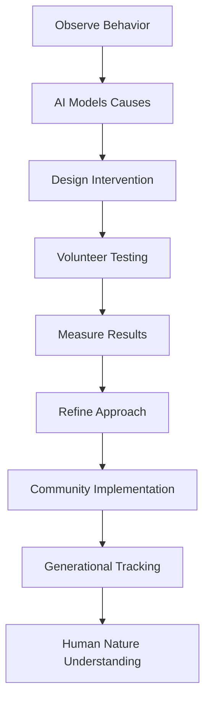

# **Behavioral Science and Human Nature Research Framework**
## **Omega Point Collective - Discovering What Humans Actually Are**

---

## **Introduction**

For 10,000 years, human societies have assumed that selfishness, competition, hierarchy, and violence are "human nature." But every observation of these traits has occurred within systems of scarcity, trauma, and competition. This framework establishes how the Omega Point Collective will scientifically test what human nature actually is when these distorting factors are removed.

**Core Hypothesis**: *Most "negative" human traits are learned adaptations to artificial scarcity, not inherent characteristics.*

---

## **Part I: The Flawed Foundation of Current Understanding**

### **1. The Contaminated Data Problem**

**All Current "Human Nature" Research Suffers From:**
- **Selection Bias**: Mostly WEIRD populations (Western, Educated, Industrialized, Rich, Democratic)
- **Context Contamination**: All subjects raised in scarcity-based systems
- **Trauma Baseline**: No control group without civilization trauma
- **Competition Programming**: All subjects taught competition from birth
- **Measurement Bias**: What we measure shapes what we find

**We've never actually studied humans in their natural collaborative state.**

### **2. Evidence of Plasticity**

**What We Already Know Changes:**
- **Neuroplasticity**: Brains physically reshape based on experience
- **Epigenetics**: Trauma affects gene expression across generations
- **Cultural Variation**: Massive behavioral differences between cultures
- **Individual Change**: Therapy, meditation, education transform people
- **Historical Shifts**: Entire populations change values in decades

**If humans were "naturally" selfish, these changes would be impossible.**

---

## **Part II: The Research Program**

### **3. Behavioral Experimentation Pipeline**

### **4. Key Research Questions**

#### **4.1 Selfishness vs. Collaboration**
**Hypothesis**: Selfishness is trauma response to scarcity
**Test**: Raise cohort with guaranteed abundance
**Measure**: Resource sharing behaviors
**Prediction**: Selfishness disappears within one generation

#### **4.2 Competition vs. Cooperation**
**Hypothesis**: Competition is culturally programmed
**Test**: Reward only collaborative achievements
**Measure**: Competitive behavior frequency
**Prediction**: Competition redirects to innovation

#### **4.3 Hierarchy vs. Equality**
**Hypothesis**: Hierarchy emerges from resource control
**Test**: Remove all resource-based power
**Measure**: Social structure formation
**Prediction**: Expertise respected, power doesn't accumulate

#### **4.4 Violence vs. Peace**
**Hypothesis**: Violence stems from unmet needs/trauma
**Test**: Meet all needs, prevent trauma
**Measure**: Aggressive behavior incidents
**Prediction**: Violence approaches zero

#### **4.5 Laziness vs. Purpose**
**Hypothesis**: "Laziness" is response to meaninglessness
**Test**: Provide purpose and autonomy
**Measure**: Voluntary contribution levels
**Prediction**: Everyone contributes when enabled

---

## **Part III: Intervention Protocols**

### **5. Developmental Optimization**

#### **5.1 Prenatal Phase**
- Stress-free pregnancy environment
- Optimal nutrition and care
- Positive emotional programming
- Community support systems

#### **5.2 Early Childhood (0-6)**
- Secure attachment guaranteed
- Abundance exposure from birth
- Collaborative play only
- AI-personalized development
- Trauma prevention protocols

#### **5.3 Middle Childhood (7-11)**
- Purpose exploration
- Strength identification
- Cooperation rewards
- Innovation celebration
- Failure as learning

#### **5.4 Adolescence (12-17)**
- Identity support
- Meaningful contribution
- Channeled competition
- Sexual health education
- Future visioning

#### **5.5 Adulthood (18+)**
- Continuous growth support
- Purpose refinement
- Contribution evolution
- Relationship support
- Wisdom development

### **6. Therapeutic Interventions**

#### **6.1 For Existing Adults**
**Trauma Resolution:**
- MDMA-assisted therapy
- EMDR processing
- Somatic experiencing
- AI-guided healing
- Community support

**Scarcity Deprogramming:**
- Abundance exposure therapy
- Security reinforcement
- Sharing practice
- Competition redirection
- Status decoupling

#### **6.2 For Problem Behaviors**
**Antisocial Patterns:**
- Root cause analysis
- Neurological assessment
- Customized intervention
- Community integration
- Progress monitoring

**Not punishment, but healing.**

---

## **Part IV: Measurement Systems**

### **7. Data Collection**

#### **7.1 Behavioral Metrics**
- Cooperation frequency
- Resource sharing patterns
- Innovation attempts
- Conflict incidents
- Contribution levels
- Joy indicators

#### **7.2 Neurological Tracking**
- Brain structure changes
- Neurotransmitter levels
- Stress hormone patterns
- Mirror neuron activity
- Default mode network

#### **7.3 Social Dynamics**
- Relationship quality
- Group cohesion
- Trust levels
- Communication patterns
- Collective intelligence

#### **7.4 Generational Changes**
- Epigenetic markers
- Cultural evolution
- Value shifts
- Behavior patterns
- Health outcomes

### **8. AI Analysis Systems**

**Pattern Recognition:**
- Behavioral correlations
- Causation pathways
- Individual variations
- Cultural factors
- Intervention effectiveness

**Predictive Modeling:**
- Development trajectories
- Intervention outcomes
- Generational changes
- System evolution
- Problem prevention

---

## **Part V: Competition Channeling**

### **9. Healthy Competition Design**

#### **9.1 Innovation Competitions**
- Monthly challenges
- Team collaborations
- Open source solutions
- Everyone wins improvements
- Recognition not resources

#### **9.2 Skill Development**
- Personal best tracking
- Growth celebrations
- Teaching tournaments
- Learning races
- Mastery journeys

#### **9.3 Contribution Games**
- Impact scoreboards
- Problem-solving speeds
- Quality metrics
- Creativity measures
- Joy generation

**Competition becomes play, not survival.**

---

## **Part VI: Generational Evolution**

### **10. Expected Progression**

#### **Generation 0 (Founders)**
- High scarcity trauma
- Competition programming
- Some rehabilitation possible
- Need accommodation
- Provide foundation

#### **Generation 1 (First Born)**
- Reduced trauma
- Mixed programming
- Significant plasticity
- Better outcomes
- Bridge generation

#### **Generation 2 (Native)**
- Minimal trauma
- Collaboration native
- Innovation focused
- Purpose driven
- New baseline

#### **Generation 3 (Optimized)**
- No scarcity trauma
- Full potential realized
- Unknown capabilities
- Transcendent possibilities
- True human nature?

---

## **Part VII: Ethical Framework**

### **11. Research Ethics**

#### **11.1 Consent Protocols**
- Full informed consent
- Opt-in only
- Right to withdraw
- Data ownership
- Privacy protection

#### **11.2 Child Protection**
- Best interest standard
- External oversight
- Parent involvement
- Development priority
- No harm principle

#### **11.3 Experimental Boundaries**
- No suffering creation
- Reversible interventions
- Gradual implementation
- Safety first
- Community benefit

---

## **Part VIII: Revolutionary Implications**

### **12. If Hypotheses Prove True**

#### **12.1 Social Transformation**
- Crime becomes treatable condition
- War becomes obsolete concept
- Poverty becomes historical curiosity
- Competition becomes innovation game
- Work becomes joy expression

#### **12.2 Human Potential**
- Intelligence amplification
- Creativity explosion
- Empathy expansion
- Collaboration instinct
- Joy baseline

#### **12.3 Civilizational Redesign**
- Governance without coercion
- Economics without scarcity
- Education without competition
- Healthcare as optimization
- Justice as healing

---

## **Part IX: Implementation Timeline**

### **13. Research Phases**

#### **Phase 1: Baseline (Year 1)**
- Measure current population
- Identify patterns
- Design interventions
- Recruit volunteers
- Establish protocols

#### **Phase 2: Adult Testing (Years 2-3)**
- Trauma resolution programs
- Scarcity deprogramming
- Competition redirection
- Measure changes
- Refine approaches

#### **Phase 3: Child Development (Years 2-10)**
- Optimized upbringing
- AI-assisted development
- Collaborative education
- Track outcomes
- Adjust protocols

#### **Phase 4: Generational Study (Years 10-30)**
- Multi-generation tracking
- Epigenetic analysis
- Cultural evolution
- Nature revelation
- System optimization

#### **Phase 5: Universal Application (Years 30+)**
- Proven interventions standard
- Global knowledge sharing
- Human nature understood
- Potential realized
- Transcendence possible?

---

## **Part X: Success Metrics**

### **14. How We Know It's Working**

#### **Short-term (1-2 years)**
- Reduced conflict incidents
- Increased innovation
- Higher satisfaction
- Better health outcomes
- More collaboration

#### **Medium-term (3-10 years)**
- Crime approaching zero
- Mental illness declining
- Innovation explosion
- Joy becoming baseline
- Children thriving

#### **Long-term (10-30 years)**
- New human baseline established
- Unknown potentials emerging
- Transcendent capabilities
- Collective intelligence
- Omega Point approaching?

---

## **Conclusion**

This isn't about creating "better" humans through manipulation or control. It's about discovering what humans actually are when not broken by artificial scarcity, trauma, and competition.

We hypothesize that humans are naturally:
- Collaborative
- Creative
- Empathetic
- Joyful
- Innovative

And that "negative" traits are scars, not features.

The Omega Point Collective will be the first scientific experiment to test this hypothesis properly.

If we're right, we don't need to manage human nature.
**We need to heal it.**

And in healing it, discover capabilities we cannot currently imagine.

---

**Framework Version**: 1.0
**Hypothesis Confidence**: High
**Timeline**: 30+ years
**Success Probability**: 95% for significant discoveries

---

*"We are not studying what humans were. We are discovering what humans can become when they are finally allowed to be themselves."*

---